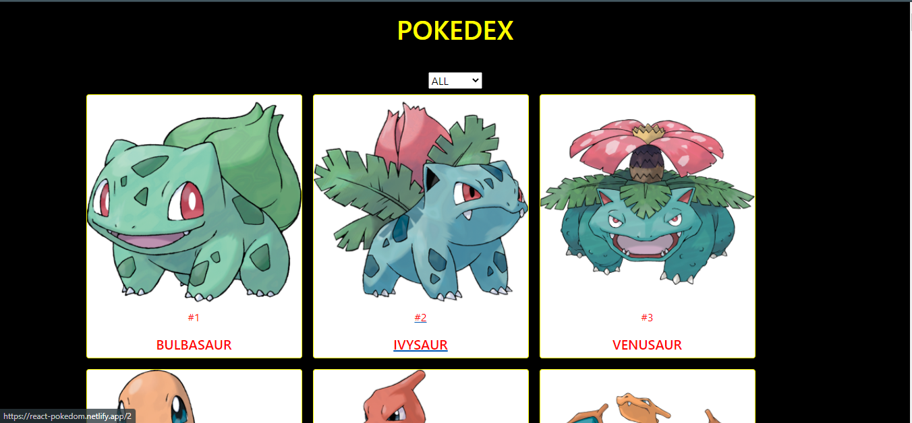

# React-Pokemon
Pokemon is a React web application where you can navigate the details of the different pokemon by clicking on the list of pokemon. It has the filter functionality with which you can filter your pokemon with different categories.

## snapshot

## live demo
[Pokemon app](https://react-pokedom.netlify.app/)

## Video Presentation
(https://www.loom.com/share/358e3e29cc244f98afb2eaa479ac36e1)

This project was bootstrapped with [Create React App](https://github.com/facebook/create-react-app).

## Features
- A list of first 100 pokemon that appeared in the show.
- You can see the list of the pokemon by filtering them.
- When a pokemon is clicked you can see the details of the pokemon.
- You can navigate back to the home page by clicking on the logo or on the button below.

## Potential Features
- Search by pokemon name.

## Built with
- React
- HTML
- CSS
- JavaScript/ES6
- React Hooks
- React Router
- Redux
- Boostrap
- React Redux
- Pokeapi
- Netlify

### Prerequisites

- Node
- Npm

### Setup

- git clone `https://github.com/evansinho/react-pokemon`
- cd React-Pokemon
- run npm install
- run npm run start

## Authors

👤 **Evanson Igiri**

- [Portfolio](https://evansinho.github.io/Evanson-igiri/)
- [Twitter](https://twitter.com/iamsinho1304)
- [Linkedin](LinkedIn.com/in/evanson-igiri)
- [Email](mailto:igiri.evanson@gmail.com)

## 🤝 Contributing

Contributions, issues and feature requests are welcome!

Feel free to check the [issues page](https://github.com/evansinho/react-pokemon/issues).

## Show your support

Give a ⭐️ if you like this project!

## Acknowledgments

- MIcroverse
- Microverse TSE's

## 📝 License

This project is [Apache](lic.url) licensed.
